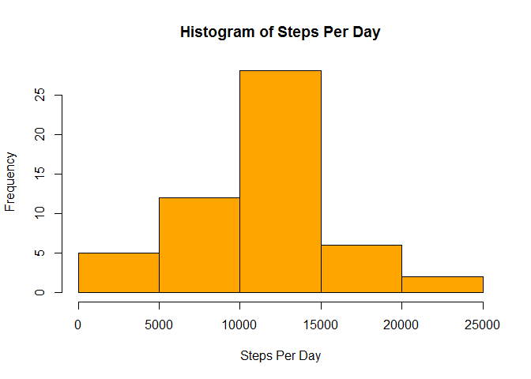
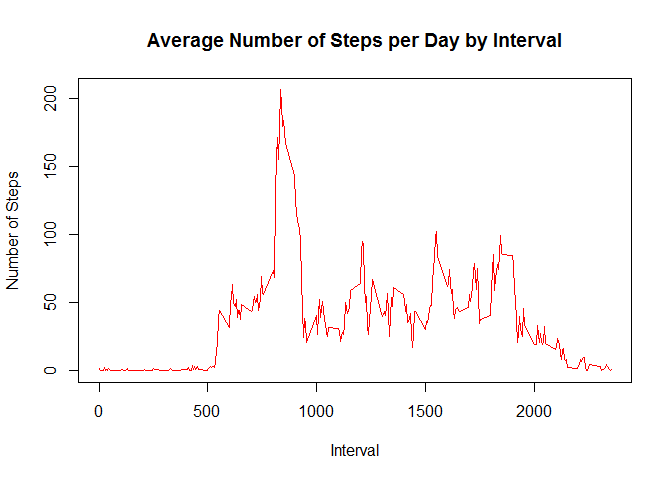
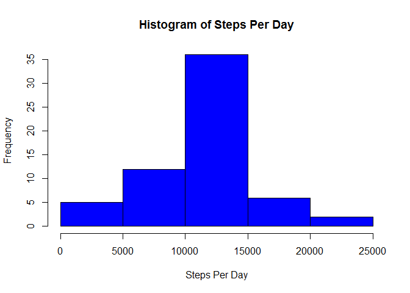
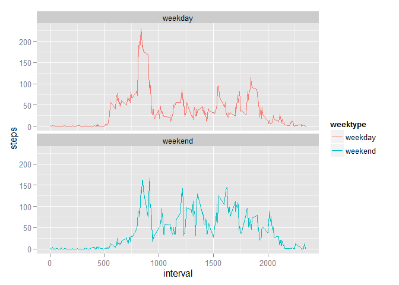

# Reproducible Research: Peer Assessment 1
Rohidah Maskuri (RM)  
October 8, 2015  
This assignment will be described in multiple parts. A report will be generated  to answer questions detailed below. The entire assignment is completed using a single R markdown document that can be processed by knitr and be transformed into an HTML file.For the plotting aspects of this assignment, a lattice and ggplot2 plotting system is used. 

### Loading and preprocessing the data
1. load lattice and ggplot2 plotting sytem libraries used in this project


```r
library(markdown)
```

```
## Warning: package 'markdown' was built under R version 3.2.2
```

```r
library(lattice)
library(ggplot2)
```

```
## Warning: package 'ggplot2' was built under R version 3.2.2
```

2. Setup a workign directory and Load the data into the dataframe

```r
setwd("C:/Users/rohidah/Google Drive/Data Science/Reproducible Research")
stepsData <- read.csv("activity.csv")
```

###What is mean total number of steps taken per day?

For this part of the assignment, the missing values in the dataset is ignored.

1. Calculate the total number of steps taken per day


```r
aggdata <-aggregate(steps~date, stepsData, sum)
```

2. Make a histogram of the total number of steps taken each day

```r
hist(aggdata$steps,main = "Histogram of Steps Per Day", xlab = "Steps Per Day", col ="orange")
```

 

3. Calculate the mean and median 

```r
mean_steps <- (mean(aggdata$steps, na.rm = TRUE))
median_steps <- median(aggdata$steps, na.rm = TRUE)

paste("The mean is : ", mean_steps)
```

```
## [1] "The mean is :  10766.1886792453"
```

```r
paste("The median is :", median_steps)
```

```
## [1] "The median is : 10765"
```


###What is the average daily activity pattern?

1. Make a time series plot (i.e. type = "l") of the 5-minute interval (x-axis) and the average number of steps taken, averaged across all days (y-axis)


```r
intdata <-aggregate(steps~interval,stepsData, mean)

plot(intdata$interval,intdata$steps, type="l", xlab="Interval", ylab="Number of Steps",main="Average Number of Steps per Day by Interval", col = "red")
```

 

2. Which 5-minute interval, on average across all the days in the dataset, contains the maximum number of steps?

```r
maxint<- intdata[which.max(intdata$steps),1]
paste("On average across all the days in dataset, the",maxint,"(5-min inteval) contains the max no of steps")
```

```
## [1] "On average across all the days in dataset, the 835 (5-min inteval) contains the max no of steps"
```


###Imputing missing values. 
Note that there are a number of days/intervals where there are missing values (coded as NA). The presence of missing days may introduce bias into some calculations or summaries of the data.

1. Calculate and report the total number of missing values in the dataset (i.e. the total number of rows with NAs)


```r
print(sum(is.na(stepsData$steps)))
```

```
## [1] 2304
```


2. The strategy used to fill the missing values with by using the mean values within the interval.


```r
fulldataset <- stepsData
nas <- is.na(fulldataset$steps)
avg_interval <- tapply(fulldataset$steps, stepsData$interval, mean, na.rm=TRUE, simplify=TRUE)
```


3. Create new dataset that is equal to the original dataset but with the missing data filled-in with mean value


```r
fulldataset$steps[nas] <- avg_interval[as.character(fulldataset$interval[nas])]
```

Check that there is no missing value


```r
print(sum(is.na(fulldataset$steps)))
```

```
## [1] 0
```

```r
aggdata2 <-aggregate(steps~date, fulldataset, sum)
```

3. A histogram with the missing data in together with mean and median calculated.


```r
hist(aggdata2$steps, main = "Histogram of Steps Per Day", xlab = "Steps Per Day", col ="blue") 
```

 

```r
meandata2 <- mean(aggdata2$steps, na.rm = TRUE)

paste("The mean of the complete datasets with missing values filled is :",meandata2)
```

```
## [1] "The mean of the complete datasets with missing values filled is : 10766.1886792453"
```

```r
mediandata2 <- median(aggdata2$steps, na.rm = TRUE)

paste("The median of the complete datasets with the missing values filled is : ", mediandata2)
```

```
## [1] "The median of the complete datasets with the missing values filled is :  10766.1886792453"
```

The values for mean is the same before and after the missing data is filled with mean which is 10766.19. There is a slight difference in the median however. The median reported with the missing data is recorded at 10765 

###Are there differences in activity patterns between weekdays and weekends?

For this part the weekdays() function may be of some help here. Use the dataset with the filled-in missing values for this part.

1. Create a new factor variable in the dataset with two levels - "weekday" and "weekend" indicating whether a given date is a weekday or weekend day.


```r
weekenddata <- subset(fulldataset,chron::is.weekend(fulldataset$date))
weekenddata$weektype <-"weekend"
weekdata = subset(fulldataset,!(chron::is.weekend(fulldataset$date)))
weekdata$weektype <- "weekday"
newdataset <- rbind(weekenddata,weekdata)
```

2. Make a panel plot containing a time series plot (i.e. type = "l") of the 5-minute interval (x-axis) and the average number of steps taken, averaged across all weekday days or weekend days (y-axis). 


```r
aggdata3 <-aggregate(steps~interval+weektype, newdataset, mean)
ggplot(aggdata3)+ geom_line(aes(x=interval, y=steps, color = weektype)) + facet_wrap( ~ weektype, ncol=1)
```

 

